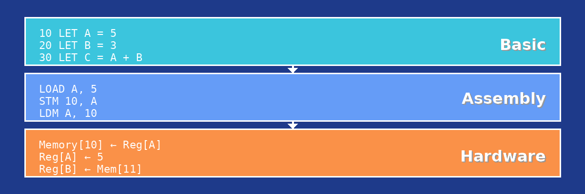

# BasCAT - BASIC Computer Architecture Trainer



**Learn computer architecture by seeing it in action.** BasCAT is an educational 8-bit computer simulator that lets you write code, watch data flow through the CPU, and understand how computers really work.

---

## ✨ Key Features

🔧 **Visual Circuit Simulation** — Watch data flow through CPU, ALU, registers, memory, and buses in real-time

📝 **Dual-Level Programming** — Write in SimpleBASCAT (high-level) and see the assembly code it generates

🐛 **Interactive Debugging** — Step through code instruction-by-instruction and watch the circuit animate

📊 **Performance Metrics** — Track instruction count, execution flow, and program size

🖥️ **Memory-Mapped I/O** — Interactive input/output system for building real programs

📚 **Example Programs** — Learn from included examples covering all features

---

## 📸 Screenshots

### Main Interface


### Circuit Visualization with Active Execution


### Code Editor with Dual BASIC/Assembly View


### Memory and I/O Panels


---

## 🚀 Quick Start

### Download

Choose the version for your platform:

| Platform | Download |
|----------|----------|
| 🐧 Linux | [bascat-linux](binaries/linux/) |
| 🪟 Windows | [bascat-windows.exe](binaries/windows/) |
| 🍎 macOS | [bascat-macos](binaries/macos/) |

### Running from Source

```bash
# Clone the repository
git clone <repository-url>
cd BasCAT

# Setup (creates virtual environment and installs dependencies)
./setup.sh

# Run the application
./run.sh
```

---

## 🎓 What You'll Learn

- **Assembly Language** — 23 instructions including arithmetic, logic, branching, and I/O
- **CPU Architecture** — How the ALU, registers, and control unit work together
- **Memory Systems** — RAM, stack operations, and memory-mapped I/O
- **Compilation** — See how high-level code translates to machine instructions

---

## 📖 Documentation

- **F1** — Assembly Instruction Reference
- **F2** — SimpleBASCAT Language Guide
- **Examples Menu** — Load and explore sample programs

---

## 💻 System Requirements

- **From Source**: Python 3.12+, PyQt6
- **Binary**: No dependencies required

### Display Requirements

| View Mode | Minimum Window Size |
|-----------|---------------------|
| BASIC + Assembly | 1640 × 965 |
| BASIC Only | 1360 × 965 |
| Assembly Only | 1340 × 965 |

**Recommended**: 1920×1080 (Full HD) or higher

| Resolution | Supported |
|------------|-----------|
| 1920×1080 (FHD) | ✅ Yes |
| 2560×1440 (QHD) | ✅ Yes |
| 3840×2160 (4K) | ✅ Yes |
| 1366×768 (HD) | ❌ Too small |

## 🏗️ Architecture Overview

| Component | Description |
|-----------|-------------|
| **CPU** | 8-bit with embedded ALU, 4 general registers (A, B, C, D) |
| **Memory** | 256 bytes RAM with stack support |
| **I/O** | Memory-mapped input (0xFF) and output (0xFE) |
| **Buses** | Visual data and address bus animations |

---

## 🎓 For Educators

A comprehensive **15-week Computer Science course** is available for educators and institutions using BasCAT.

### Course Overview

| Part | Weeks | Focus |
|------|-------|-------|
| **Part 1** | 1-6 | Assembly Programming |
| **Part 2** | 7-10 | BASIC Programming & Compilation |
| **Part 3** | 11-15 | Computer Architecture Concepts |

**Topics include**: Data movement, arithmetic & I/O, logic operations, control flow, stack & memory, CPU architecture, pipelining, cache memory, and more.

**Course materials include**: Weekly lesson plans, lab activities, quizzes, projects, student handouts, and teacher resources.

📧 **Interested?** Contact us to request course materials:
- **Email**: [info@fragillidaesoftware.com](mailto:info@fragillidaesoftware.com)
- **Website**: [www.fragillidaesoftware.com](https://www.fragillidaesoftware.com)

---

*"Understanding computers from the ground up"*